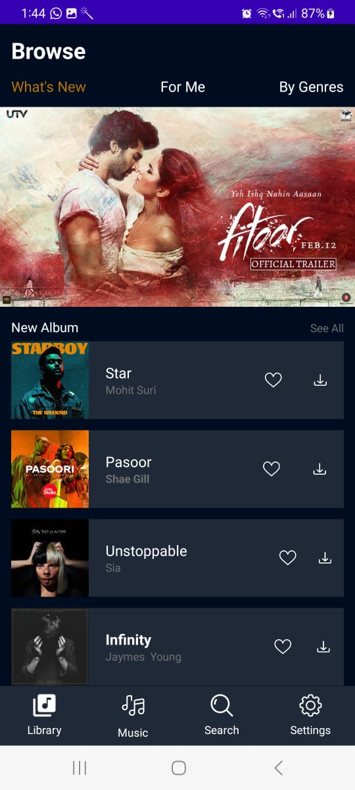
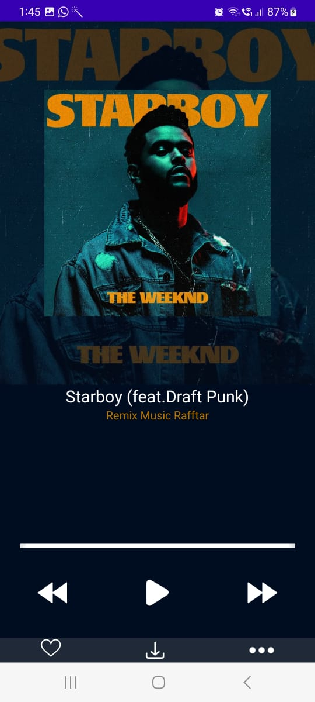
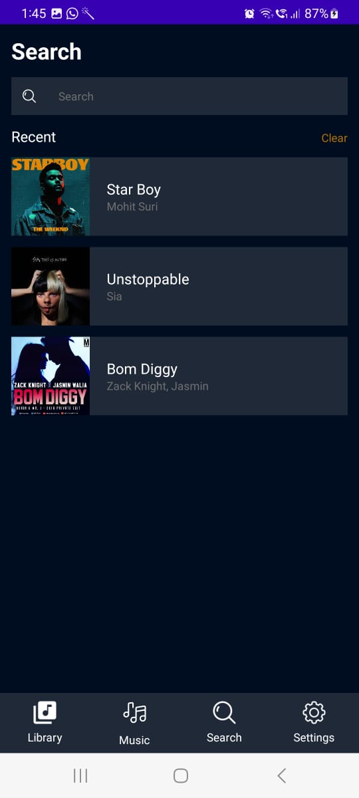
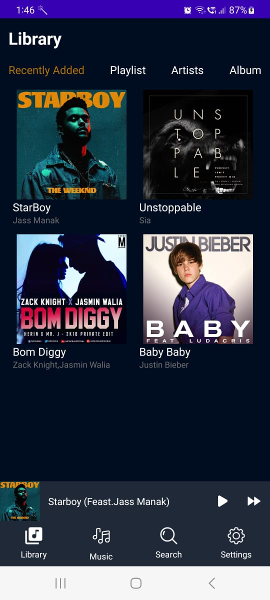

# Music App UI

This repository contains the user interface (UI) code for the Music App, a simple application designed to help users plan and organize their Mu experiences.

## Features

- **Sleek Design:** Modern and visually appealing user interface.
- **Responsive Layout:** Adapts to various screen sizes for a seamless experience.
- **Intuitive Navigation:** User-friendly design for easy exploration.


## Screenshots
<div align="center">
  
  
  
  
  
</div>


## Getting Started

### Prerequisites

- Ensure you have [Node.js](https://nodejs.org/) installed on your machine.

### Installation

1. Clone the repository:

   ```bash
   git clone https://github.com/ShiroyaShubham/MusicApplication.git
